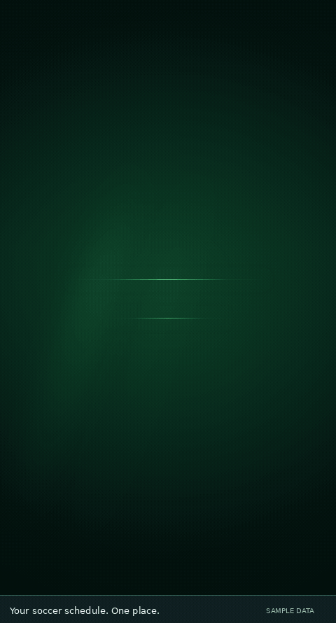

# BallerWatch

BallerWatch is a privacy-first soccer PWA for pickup games and Seattle RATS league matches. It brings schedules, RSVP capacity, weather, reminders, league updates, Calendar sync, and quick answers into one installable app.

**Current source version: 8.1.0**

[Open BallerWatch](https://vudh1.github.io/ballerwatch/) · [Version guide →](https://github.com/vudh1/ballerwatch/wiki/Versions) · [GitHub Releases](https://github.com/vudh1/ballerwatch/releases)

> `main` is reviewed source. `production` is the exact released commit. The live app changes only after a validated promotion.

## What you can do

- See the next **Pickup** or **League** match with a cleaner visual hierarchy for location, weather, RSVP, and secondary actions. Newly published RSVP dates remain in the match-card carousel and expanded calendar even beyond the initial 14-day grid; missing field details show *Venue to be announced* until the RSVP source publishes a location.
- See RSVP capacity for pickup games; tap the capacity area to open the full-width roster sheet and RSVP from inside it.
- Browse a rolling match calendar and swipe between match cards; on desktop, the waterfall stays visually full-height while the Pickup/League Edit/Delete trigger keeps pointer priority over the carousel hit area.
- Use a real **Inbox** with Pickup / League / App filters, mark-all-read, swipe delete, and account-synced read state.
- Choose account-level notification categories and keep the unread count synchronized to the installed app badge on supported devices.
- Get allowed Web Push reminders and real schedule-change notifications.
- **Dynamic pickup capacity alerts:** RSVP bookings trigger at **25%, 50%, and 75%** of each published match's capacity, then each additional occupied spot through full. Thresholds round up to whole reservations (e.g., 16 slots alerts at 4, 8, 12, 13, 14, 15, and 16). A new match starts with a silent baseline, so past thresholds are not replayed; cancellations or settings-only capacity changes do not trigger booking alerts. The 24-hour RSVP and one-hour kickoff reminders remain separate, and muting/snoozing is honored.
- Open **Inbox** and **Settings** from the top-right notification bell and gear.
- Ask **BallerWatch AI** about opponents, match fields, jersey colors, weekly briefings, next games, and indexed RATS results—with follow-ups for a specific fixture.
- Sign in with separate user accounts and revocable sessions.
- For administrators: manage users, monitored RATS teams, reversible match overrides/deletes, and app promotion.
- Keep real RATS schedule changes synchronized to Google Calendar.

Saturday synthetic pickup is shown simply as **Pickup** and has no RSVP/capacity watcher.

## Demo



A 22-second walkthrough with a short animated intro. Recorded from the app using synthetic sample data; game details, answers, and notifications are illustrative.

[Open BallerWatch](https://vudh1.github.io/ballerwatch/)

## BallerWatch AI 8.1 — stronger answers and reviewed feedback

- **Privacy-gated free AI intent fallback:** If local routing cannot understand a short, public soccer question, the Cloudflare Worker may use configured Gemini/Groq providers to select a strict read-only intent. Account details, roster names, emails, phone numbers, locations/addresses, and user-specific RSVP questions are never forwarded. Providers return classification **only**, not unverified answer text; no provider is needed for standard questions.
- **Signed-in RSVP questions:** `Am I in for Thursday pickup?` checks **only the authenticated user's configured RSVP name** against encrypted roster data. It reports confirmed, waitlisted, not listed, or unavailable without exposing others. Unauthenticated users are asked to sign in.
- **Historical answer correctness:** Explicit head-to-head questions now require two identified teams. If one club is unknown, the bot asks for clarification rather than returning a misleading single-team W-D-L record. Results name the indexed season range and disclose gaps in archived coverage.
- **Evidence links:** Supported factual answers can open their official RATS schedule or pickup RSVP source link. Browser links are allowlisted and not rendered from arbitrary HTML.
- **Safer conversation memory:** Fixture/date/history context expires after 20 minutes of inactivity in the current browser session.
- **A six-hour improvement check:** The encrypted, privacy-safe review job rechecks historical, fixture, briefing and classifier regressions. No model weights or code are silently retrained or deployed. New bot requests receive a distinct category in future anonymized summaries.
- **Feedback audit that drove this release:** The most recent sanitized review contained 4 RATS-history and 1 monitored-teams negative feedback reports; the request projection had 10 unclassified "other" and 1 schedule report. Those historical counts do not expose question text or prove each report is individually fixed. New tests specifically target historical H2H misclassification and authenticated RSVP answer correctness.

## BallerWatch 8 — BallerWatch AI

BallerWatch AI combines the existing verified RATS history index, live schedules, pickup RSVP totals, and short-lived on-device conversation context. The core factual answering path is deterministic and needs **no paid AI service**. The app never guesses a location, game, result, or personal RSVP.

- **Ask by opponent:** `When do we play PhoSaiGon?`, `Where is Supermokh FC vs PhoSaiGon?`. Queries with two clubs must resolve to the same official fixture, not unrelated games.
- **Natural follow-ups:** After one fixture, ask `Where is that match?`, `What jersey do we wear?` or `What time?`. Fixture context stays in the browser session and is validated against the current, visibility-filtered schedule.
- **Weekly briefing:** `Brief me on this week` or `Which pickup is filling up?` combines the next seven days of RATS matches and published RSVP counts. Occupancy at or above 75% is flagged without showing private participants.
- **Source-aware, bounded answers:** The bot labels published RATS schedule information and calls out missing times, venues, or unavailable history rather than making claims beyond the data.
- **Privacy-safe improvement:** The existing encrypted thumbs-down engineering reviews run every six hours, and league/pickup source indexes refresh on their existing schedules. This makes the *data* fresher over time; it is **not autonomous training of model weights**. Proposed behavior changes are tested and reviewed before a new release.

BallerWatch AI remains **read-only**. Match edits, RSVPs, and app promotions use their existing authenticated controls; a chat question cannot perform those actions.

## BallerWatch 7

BallerWatch 7 turns the PWA into a more complete account-backed app experience:

- **Cross-device state:** signed-in notification reads, deletes, and category preferences are stored in the encrypted user profile and merge safely across devices.
- **Notification center:** Inbox filters Pickup, League, and App updates; supports mark-all-read and swipe/delete; and keeps the Home Screen badge aligned with unread state.
- **Account-aware Web Push:** each device subscription can follow its signed-in account's notification categories without exposing account data in push payloads.
- **Cleaner PWA architecture:** transport/session handling and notification persistence live in focused frontend modules instead of the main view controller.
- **App navigation:** Inbox and Settings stay one tap away through the top-right bell and gear, without a persistent bottom tab bar.
- **Notification layering:** Notification details return to Inbox as a true modal, keeping the notification surface above the dashboard until it is actually closed.
- **Launch experience:** the cinematic intro owns the first browser paint on a fresh session, preventing the dashboard from flashing underneath it before the animation starts.
- **Original stadium music:** the optional music toggle now drives a self-contained Web Audio football anthem with percussion, claps, brass-like stabs, bass, and an original celebratory hook; no third-party audio files are bundled.
- **RATS history:** Ask BallerWatch uses a deterministic encrypted index of public RATS season results to answer team records, season history, and head-to-head questions. Score strings are parsed directly from published results, archive discovery advances incrementally, and partial coverage is labeled instead of being presented as all-time.
- **RATS venue directory:** the league watcher saves exact field URLs from RATS fixtures and venue catalogs and checks new/unresolved RATS venue pages for published Maps links. Confirmed destinations are encrypted and reused for Directions and Share; Mod North/South and numbered pitches remain distinct. Missing or ambiguous RATS links use field GPS or Google Maps search rather than a guessed exact pin. The Schedule & Standings source is checked for clickable Maps links; its field-name Maps query format is also stored as an explicitly non-GPS fallback when the JavaScript-rendered link is unavailable. Both Share and Directions reuse the best cached destination.

Signed-out use still works: local read/delete state and anonymous Web Push remain available, and local notification state is migrated into the account after a successful sign-in.


## App updates

Administrators can open **Settings → App update** and promote a validated source version.

Promotion is intentionally staged:

1. the release is validated and `production` advances;
2. the Cloudflare Worker deploys and passes live readiness/security checks;
3. GitHub Pages deploys the matching PWA from `production`;
4. the already-open PWA detects that both Worker and Pages reached the target version, updates its service worker, and **refreshes itself automatically**.

You should not need to close and reopen the installed app after a normal promotion.

For the difference between source, production, tags, and releases, see the **[Versions guide](https://github.com/vudh1/ballerwatch/wiki/Versions)**.

## How it is built

```text
GitHub Pages PWA
       |
       v
Cloudflare Worker
  |        |
  |        +--> encrypted runtime-state
  +-----------> auth / synced Inbox / Q&A / push registration / API

cron-job.org
  |--> Pickup watcher every 2 min
  +--> RATS watcher every 5 min

GitHub Actions
  |--> reconciliation + Web Push
  |--> watchdog/weather every 6 hr
  |--> release promotion/deployment
  +--> Google Calendar reconciliation
```

Workers KV and Cloudflare Cron Triggers are intentionally not part of production.

## Repository map

The repository now separates browser code from backend code explicitly:

```text
frontend/
  web/                    GitHub Pages PWA: HTML, CSS, app shell, manifest, service worker
    lib/                  session/API transport + notification-state modules

backend/
  infra/                  Cloudflare Worker + scheduler/infrastructure helpers
  pickup/                 pickup ingestion and notification logic
  league/                 RATS watcher + Google Calendar integration
  shared/                 encryption, runtime state, auth, push, common domain logic
  watchdog/               health/release monitoring
  weather/                match-window weather pipeline

tests/
  frontend/               PWA/browser regression tests
  backend/                backend tests mirrored by domain

docs/
  demo.gif                animated README walkthrough
  wiki/                   maintained project documentation

features/versions.json    product version ledger
scripts/                  repository checks/tooling
.github/workflows/        validation, runtime, release, recovery, deployment
```

The encrypted `runtime-state` branch intentionally keeps stable storage paths such as `pickup/state/`, `league/state/`, and `state/`. Those are storage contracts and do **not** mirror the source directory layout.

## Accounts and recovery

BallerWatch supports up to 20 encrypted web accounts. Each account has its own username, password, RSVP display name, authentication revision, revocable sessions, and bounded notification profile for cross-device read/delete state and category preferences.

Administrators can manage users and shared league configuration. Regular users can manage their own RSVP name/password.

Forgotten-password recovery is repository-admin controlled:

1. set temporary Actions secret `BALLERWATCH_RECOVERY_PASSWORD`;
2. run **Actions → Reset web user password**;
3. choose the username and type `RESET`;
4. sign in with the replacement password;
5. delete or rotate the temporary recovery secret.

The recovery workflow never intentionally prints or persists the plaintext password.

## Privacy and security

The public source repository is never used as readable application-data storage.

Canonical runtime documents are stored as complete hardened AES-GCM envelopes on the dedicated `runtime-state` branch, including user settings, schedules, weather/geocode cache, Web Push state, notification-board state, and retained feedback/feature-request state.

Other important boundaries:

- Web Push registration accepts only validated public browser push-service endpoints and revalidates them before delivery.
- User-specific RSVP names, confirmation state, waitlist information, notification read/delete state, and notification preferences are never put on the public notification board.
- Web Push signals remain payload-free; account/category metadata stays inside encrypted runtime state.
- The Worker API emits CSP/anti-framing/content-type/referrer/permissions security headers.
- Tests, smoke checks, builds, deploys, watchdog health events, commits, PRs, and score-only changes never send user notifications.
- Exact Q&A text is retained only under the narrow documented conditions and time limits.

More detail: [Data and Privacy](https://github.com/vudh1/ballerwatch/wiki/Data-and-Privacy) · [Architecture](https://github.com/vudh1/ballerwatch/wiki/Architecture)

## Scheduling

| Work | Cadence | Executor |
| --- | --- | --- |
| Pickup watcher | every 2 minutes | cron-job.org → GitHub Actions |
| RATS watcher | every 5 minutes | cron-job.org → GitHub Actions |
| Watchdog + weather | every 6 hours | GitHub Actions |
| Release eligibility | hourly | GitHub Actions |
| Web API | on demand | Cloudflare Worker |
| Calendar sync | on reconciled RATS changes | GitHub Actions → Apps Script |

## Release flow

1. Create `release/<version>` from current `main`.
2. Implement and pass **Validate code**.
3. Update `features/versions.json` and current docs.
4. Open a PR to `main`; squash merge only after checks pass.
5. Promotion publishes the GitHub Release and advances `production`.
6. Worker readiness must pass before Pages deploys.
7. The open PWA auto-refreshes when the complete release is live.

Automatic promotion uses a 24-hour soak; an administrator can manually request promotion without bypassing validation.

See [Release Process](https://github.com/vudh1/ballerwatch/wiki/Release-Process) and [Versions](https://github.com/vudh1/ballerwatch/wiki/Versions).

## Required configuration

| Area | Configuration |
| --- | --- |
| Core runtime | `TRACKER_STATE_KEY`, `OWNER_RSVP_NAME`, `UPSTREAM_ENDPOINT` |
| GitHub/scheduling | `CRON_GITHUB_PAT`, `CRON_JOB_ORG_API_KEY`, `RELEASE_GITHUB_TOKEN` |
| Cloudflare | `CLOUDFLARE_ACCOUNT_ID`, `CLOUDFLARE_API_TOKEN` |
| AI | `GEMINI_API_KEY`, `GROQ_API_KEY` |
| Calendar | `GOOGLE_CALENDAR_WEBHOOK_URL`, `GOOGLE_CALENDAR_WEBHOOK_SECRET` |
| Recovery | temporary `BALLERWATCH_RECOVERY_PASSWORD` |

Web Push VAPID material is generated by BallerWatch and stored encrypted in runtime state.

## Local validation

```bash
node --test
node backend/infra/validate-versions.mjs
node scripts/privacy-audit.mjs
```

With an authenticated repository checkout, runtime-state changes should also run:

```bash
node backend/shared/runtime-state.mjs audit
```

Tests and smoke helpers must remain notification-silent and must not mutate Google Calendar.

## Copyright

Copyright © 2026 BallerWatch. All rights reserved. See [COPYRIGHT.md](COPYRIGHT.md) for the repository publication notice.

## Failure behavior

- **Cloudflare unavailable:** live app API/Q&A/board reads fail closed; scheduled GitHub reconciliation can continue.
- **runtime-state unavailable:** supported workflows may recover from the encrypted last-known Actions cache.
- **RATS temporarily unavailable:** bounded retries run; a verified last-good schedule may be retained for transient source failures.
- **Invalid release/content credentials:** release/deployment readiness fails closed.
- **Web Push:** once a validated subscription is stored, delivery does not require Cloudflare at send time.

## More documentation

[Wiki home](https://github.com/vudh1/ballerwatch/wiki) · [Versions](https://github.com/vudh1/ballerwatch/wiki/Versions) · [Operations](https://github.com/vudh1/ballerwatch/wiki/Operations) · [Development](https://github.com/vudh1/ballerwatch/wiki/Development)

Copyright © 2026 BallerWatch. All rights reserved. See `COPYRIGHT.md`.
