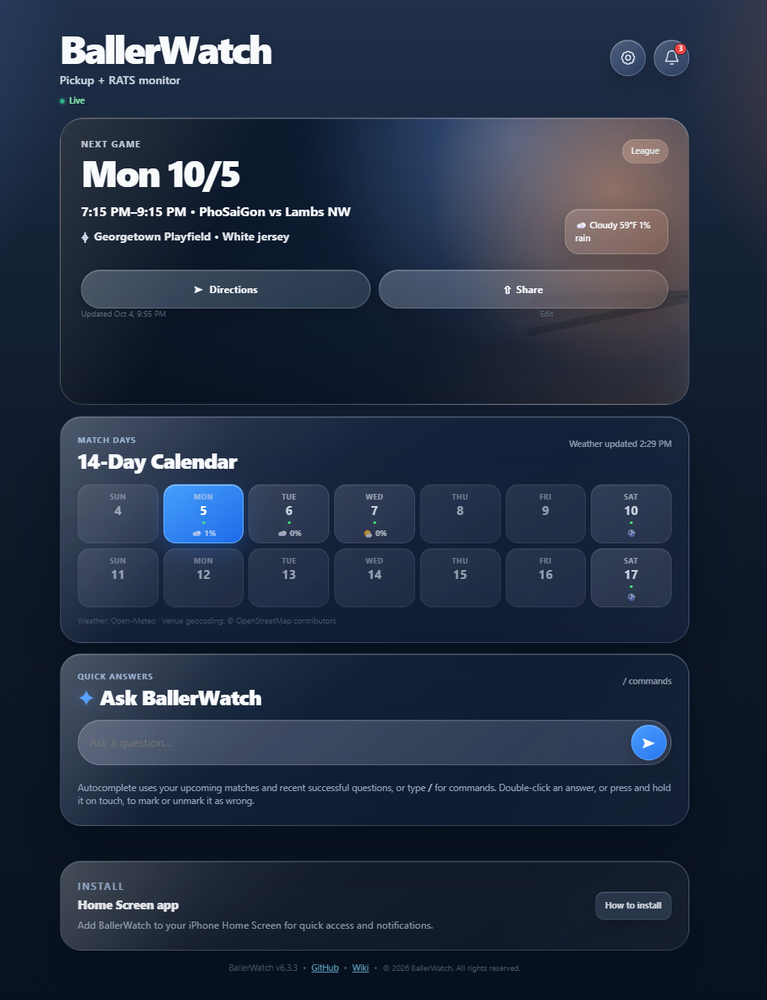

# BallerWatch

BallerWatch is a privacy-first soccer operations PWA for pickup games and Seattle RATS league matches.

**Current source version: 6.2.0**

**Production source of truth:** the commit pointed to by `production` and its published GitHub Release. `main` may be newer without changing the live app.

## What it does

- Shows the next pickup or league match, RSVP capacity, field, and match-window weather.
- Provides a 14-day game calendar.
- Supports touch swiping and desktop card-edge navigation.
- Answers read-only questions such as `What time is Thursday?`, `What games are next week?`, or `/next`.
- Sends the narrow allowed notification set through Web Push.
- Supports multiple username/password accounts, each with an independent pickup RSVP name, password, and revocable sessions.
- Keeps monitored league teams shared and administrator-controlled so users cannot overwrite one another's league configuration.
- Supports answer-specific wrong-answer feedback without granting Settings access: double-click an answer on desktop, or press and hold it on touch; repeat the gesture to undo.
- Lets a signed-in user submit encrypted feature requests with `/feature describe what you want`; only category/count aggregates are exposed publicly.
- Synchronizes real RATS schedule changes to Google Calendar.
- Lets the administrator apply encrypted manual date/time/location overrides to the selected match: press and hold the app version, or double-click the match card on desktop; Reset to source removes the override. Overrides also drive reminder timing and weather; RATS overrides additionally drive Google Calendar reconciliation.

**Live app:** https://vudh1.github.io/ballerwatch/

## Demo



## 6.0 web-only architecture

BallerWatch 6.0 removes the retired external messaging integration completely. The PWA is the sole user surface; there is no secondary chat adapter, webhook route, listener workflow, adapter credential, or alternate notification transport.

```text
GitHub Pages PWA
       |
       v
Cloudflare web Worker
  |        |        |
  |        |        +--> encrypted runtime-state
  |        +-----------> Web Push registration / public-safe Q&A
  +--------------------> multi-user password auth + Settings

cron-job.org
  |--> pickup every 2 min --> GitHub Actions --> Web Push / state
  +--> league every 5 min --> GitHub Actions --> Calendar + Web Push / state

GitHub native schedule --> watchdog + 14-day weather every 6 hr
```

| Boundary | Responsibility |
| --- | --- |
| `main` | Reviewed integration code; may be ahead of production. |
| `production` | Exact promoted release commit. |
| `runtime-state` | Generated data only; every canonical file is one hardened AES-GCM envelope. |
| Cloudflare Worker | Web/PWA API, per-user auth, read-only Q&A, runtime access, push registration, health. |
| GitHub Actions | Reconciliation, Web Push delivery, Calendar work, validation, recovery, release promotion. |
| cron-job.org | Pickup 2-minute and league 5-minute dispatch only. |

Workers KV and Cloudflare Cron Triggers are intentionally not part of production.

## User sign-in and recovery

BallerWatch supports up to 20 encrypted web accounts. The existing pre-6.1 account migrates automatically as **admin**.

Each account has its own username, password, pickup RSVP name, authentication revision, and device sessions. The administrator can add/remove users, edit the shared monitored-team list, and override discovered match date/time/location; regular users can edit only their own RSVP name and password.

Changing a password or choosing **Sign out all my devices** advances only that user's authentication revision and invalidates that user's older tokens.

Forgotten-password recovery remains repository-admin controlled:

1. Set the temporary repository Actions secret `BALLERWATCH_RECOVERY_PASSWORD` to the replacement password.
2. Run **Actions → Reset web user password**.
3. Enter the target BallerWatch username (use `admin` for the migrated original account) and type `RESET`.
4. The workflow updates only that encrypted account and revokes only that user's existing sessions.
5. Delete or rotate the temporary recovery secret after the workflow succeeds.

The recovery workflow never intentionally logs or stores the plaintext password.

## Privacy and runtime storage

The public repository is never used as readable application data storage.

Every canonical `runtime-state` file is encrypted at rest, including:

- `state/user.json`;
- pickup and league snapshots;
- monitored teams;
- Calendar reconciliation state;
- weather/geocode cache;
- watchdog state;
- Web Push VAPID private material and subscriptions;
- notification-board state;
- retained Q&A/review signals;
- feature-request state.

The 6.0 deployment migrates the previous encrypted user-state filename into `state/user.json`, then the snapshot writer compacts the old filename away.

Exact Q&A text is retained for at most 48 hours only for authenticated exchanges or when an anonymous visitor explicitly marks an answer wrong. Public notification-board projections remain public-safe.

## Web Push security boundary

Push registration accepts only recognized browser push-service endpoints. URLs must use HTTPS, contain no userinfo or IP literal, use a normal port, resolve only to public addresses, and pass an endpoint-bound server challenge. Delivery repeats URL/DNS validation and uses `redirect: "error"`.

This prevents persisted subscription URLs from becoming a delayed network-probing capability.

## Browser security

The Worker API emits CSP, anti-framing, `X-Content-Type-Options`, Referrer-Policy, and Permissions-Policy headers. The Pages document declares a restrictive CSP/no-referrer policy, and the service worker restricts notification navigation to the BallerWatch Pages origin/path.

GitHub Pages itself does not provide arbitrary repository-controlled response headers, so response-header controls are enforced on the Worker API rather than falsely claimed for the static document.

## Notification policy

Allowed proactive user notifications:

- new pickup dates and public pickup time/location updates;
- pickup low-capacity thresholds at 3, 2, 1, and full;
- one generic pickup RSVP reminder during the 24-hour window before kickoff;
- one generic pickup or RATS match reminder during the final 60 minutes before kickoff;
- real RATS schedule changes;
- one combined release announcement per Pacific day.

Web Push is a shared broadcast channel. User-specific RSVP names, roster names, confirmation state, and waitlist position stay inside authenticated app views and are never placed on the public notification board.

Tests, smoke runs, builds, deploys, watchdog health events, commits, PRs, score-only changes, and setup reminders must not send Web Push.

## Scheduling

| Work | Cadence | Executor |
| --- | --- | --- |
| Pickup watcher | every 2 minutes | cron-job.org → GitHub Actions |
| RATS watcher | every 5 minutes | cron-job.org → GitHub Actions |
| Watchdog + weather | every 6 hours | GitHub Actions schedule |
| Release eligibility | hourly | GitHub Actions |
| Web API / PWA | event-driven | Cloudflare Worker |
| Settings / feedback | user-driven | PWA → Worker → encrypted runtime |
| Calendar sync | only for reconciled schedule changes | GitHub Actions → Apps Script |

## Release model

A merge to `main` is not a production deployment.

1. Create `release/<version>` from latest `main`.
2. Implement and run **Validate code**.
3. Update the version ledger/docs after implementation is green.
4. Open a PR and squash merge after checks pass.
5. Promotion advances `production` and publishes the GitHub Release.
6. Release-driven Worker deployment migrates/audits encrypted state and verifies live runtime-backed APIs.
7. Only after the Worker passes does it dispatch Pages deployment from `production`.

This ordering prevents the static app from switching to an API endpoint that has not passed readiness checks.

## Workflow responsibilities

| Workflow | Responsibility |
| --- | --- |
| **Validate code** | style, syntax, unit tests, Worker bundle, version ledger, privacy/security checks |
| **Promote production release** | soak/manual promotion, GitHub Release publication, `production` advancement |
| **Deploy BallerWatch Worker** | web Worker deploy, runtime migration/audit, live API/security smoke, then Pages dispatch |
| **Deploy GitHub Pages app** | static PWA deployment from `production` |
| **Reset web user password** | admin-controlled password bootstrap/recovery and session revocation |
| **Web app runtime** | VAPID / push-registration persistence |
| **Pickup watcher** | pickup refresh + allowed Web Push |
| **RATS league watcher** | league refresh + Calendar reconciliation + allowed Web Push |
| **System watchdog** | health, weather, scheduler checks, runtime encryption audit |
| **Repair external cron schedules** | manual scheduler recovery |
| **Purge current data** | generated-state factory reset |
| **Deploy Calendar bridge** | Apps Script deployment/health |
| **Publish wiki** | mirror `docs/wiki/` |

## Repository layout

```text
docs/                    PWA + maintained wiki source
infra/web-worker/        Cloudflare web runtime
infra/                   scheduler / infrastructure helpers
pickup/                  pickup source + Web Push policy
league/                  RATS source + Calendar reconciliation + web notifications
weather/                 match-window forecast pipeline
shared/                  encryption, runtime state, user recovery, push, AI
features/                product version ledger
tests/                   test-only source
.github/workflows/       validation, runtime, release, recovery workflows
```

## Required configuration

### Core web/runtime
- `TRACKER_STATE_KEY`
- `OWNER_RSVP_NAME`
- `UPSTREAM_ENDPOINT`

### GitHub / scheduling
- `CRON_GITHUB_PAT` — workflow dispatch only; deployment/repair validates it before updating cron-job.org schedules
- `CRON_JOB_ORG_API_KEY`
- `RELEASE_GITHUB_TOKEN` — release/Pages and Worker runtime-content credential

### Cloudflare
- `CLOUDFLARE_ACCOUNT_ID`
- `CLOUDFLARE_API_TOKEN`

### AI
- `GEMINI_API_KEY`
- `GROQ_API_KEY`

### Calendar
- `GOOGLE_CALENDAR_WEBHOOK_URL`
- `GOOGLE_CALENDAR_WEBHOOK_SECRET`

### Recovery
- `BALLERWATCH_RECOVERY_PASSWORD` — temporary only; set immediately before manual recovery and delete/rotate afterward

Web Push VAPID material is generated by BallerWatch and stored encrypted on `runtime-state`.

## Local checks

```bash
node --test
node infra/validate-versions.mjs
node privacy-audit.mjs
```

With an authenticated repository checkout, runtime-state work should also run:

```bash
node shared/runtime-state.mjs audit
```

Tests must never send Web Push or mutate Google Calendar.

## Failure behavior

- Cloudflare unavailable: live PWA API/Q&A/board reads fail closed; scheduled pickup/league and GitHub maintenance continue.
- Runtime branch temporarily unavailable: supported workflows may use the encrypted Actions-cache backup.
- RATS temporarily unavailable: league logic preserves the validated last-good schedule.
- RATS aggregate-only future events that are absent from the published team export are ignored; published export games remain the canonical schedule and still require strict one-to-one validation.
- Invalid scheduler dispatch credentials fail schedule synchronization before cron-job.org jobs are updated.
- Release/content credential invalid: promotion or Worker readiness fails closed.
- Web Push delivery does not require Cloudflare at send time once a validated subscription is stored.

## Scale-up principles

- Keep domain state provider-neutral.
- Keep reads fast and writes narrow.
- Encrypt before storage.
- Pin production separately from integration.
- Keep failure domains separate.
- Prefer idempotent reconciliation.
- Keep verification notification-silent.
- Revalidate persisted outbound URLs at send time.
- Pin workflow dependencies to immutable reviewed SHAs.

More operational detail is maintained under `docs/wiki/`.

## Copyright

Copyright © 2026 BallerWatch. All rights reserved. See `COPYRIGHT.md` for the repository copyright notice and third-party attribution boundary.
